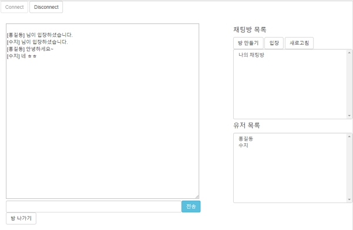

# INTRODUCTION
웹소켓을 이용한 간단한 웹채팅 구현

# RUN
Run springboot Application.java  

OR

$ mvn package
$ java -jar target/WebsocketChat-0.0.1-SNAPSHOT.jar

# TEST
1. 브라우저 창 2개 실행 http://localhost:8080
2. connection -> 방만들기 -> 아이디 입력 -> 채팅

 
# Lib, Framework 
Spring boot, Websocket, stompJs

# TODO
+ 방이름, 아이디 중복체크
+ 방만들기: subscribe -> send 동기화
+ 등등.. 